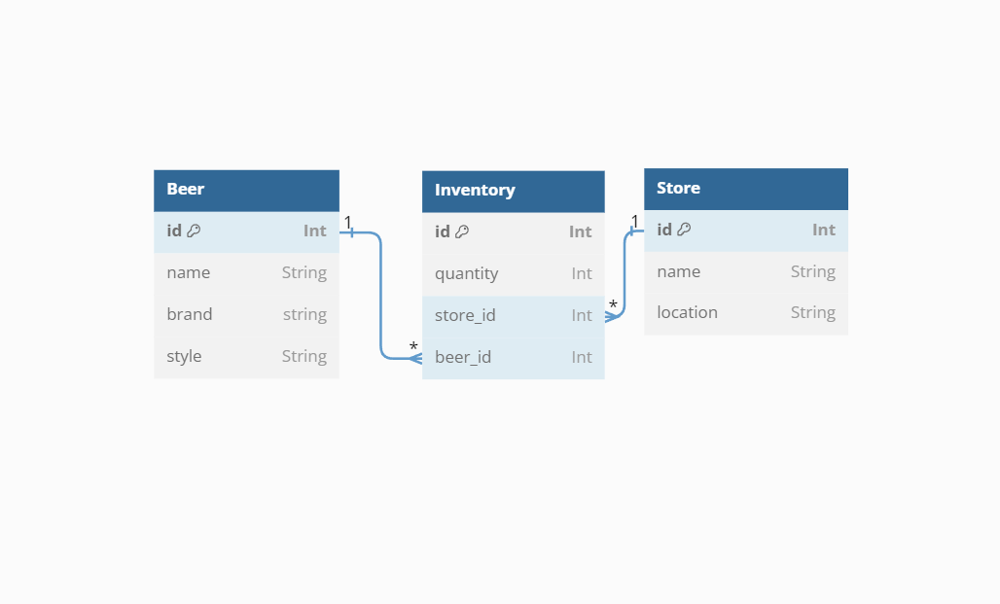

# Phase 4 Project

Wireframe: https://wireframe.cc/vmJzJI

DB Diagram: https://dbdiagram.io/d/64d2bb5c02bd1c4a5e755fa4



Simple inventory application using React JS and Flask. Some features are still in progress

Users can add/edit Stores and add product and quantities to stores.
## Setup
To download the dependencies for the backend server, run:

```console
pipenv install
pipenv shell
```

You can run your Flask API on [`localhost:5555`](http://localhost:5555) by
running:

```console
python server/app.py
```

Check that your server serves the default route `http://localhost:5555`. You
should see a web page with the heading "Phase 4 Project Server".

To download the dependencies for the frontend client, run:

```console
npm install --prefix client
```

You can run your React app on [`localhost:3000`](http://localhost:3000) by
running:

```sh
npm start --prefix client
```

Check that your the React client displays a default page
`http://localhost:3000`


## Resources

- [Setting up a respository - Atlassian](https://www.atlassian.com/git/tutorials/setting-up-a-repository)
- [Create a repo- GitHub Docs](https://docs.github.com/en/get-started/quickstart/create-a-repo)
- [Markdown Cheat Sheet](https://www.markdownguide.org/cheat-sheet/)
- [Python Circular Imports - StackAbuse](https://stackabuse.com/python-circular-imports/)
- [Flask-CORS](https://flask-cors.readthedocs.io/en/latest/)
